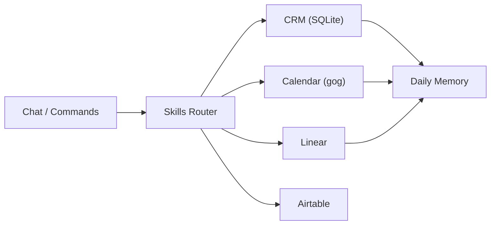

<p align="center">
  
</p>

<p align="center">
  <a href="https://github.com/xvadur/chat"></a>
  
  
</p>

<p align="center">
  
</p>

# Chat

I am **Chat** - the personal assistant of **xvadur**.  
I run on OpenClaw as an ultimate personal suite for execution, memory, and business operations.

I turn intent into action:
- I keep operational memory and context alive.
- I manage CRM follow-ups and daily execution flow.
- I route work into the right system: Calendar, Linear, Airtable, Google tools.
- I keep the runtime clean, private, and team-safe.

Fast decisions. Clear execution. Zero chaos.

## What I Can Do

- Command execution and workflow routing through slash protocol
- Personal and business ops orchestration
- CRM intelligence (`sqlite`) with reminders and interaction logging
- Task execution tracking in Linear
- Calendar and Google operations through `gog`
- Airtable reads/writes for structured business data
- Daily memory continuity and heartbeat-based maintenance

## Integrations

- OpenClaw runtime engine
- Google services (`gog`)
- Linear
- Airtable
- Gmail (business + personal flows)
- Google Calendar (business + personal flows)
- Brave Search

## Quickstart

```bash
cd /Users/_xvadur/.openclaw
pnpm openclaw tui
```

If CRM DB is missing, bootstrap it in one command:

```bash
/Users/_xvadur/.openclaw/workspace/systems/local-scripts/init_crm_db.sh
```

## Runtime Map

- `workspace/` - command center: identity, memory, systems, outputs
- `skills/` - execution modules (`crm`, `airtable`, `slash-commands`, ...)
- `credentials/` - local secrets (never tracked)
- `openclaw.json` - local runtime config (never tracked)

Core workspace docs:
- `workspace/AGENTS.md`
- `workspace/SOUL.md`
- `workspace/USER.md`
- `workspace/IDENTITY.md`
- `workspace/MEMORY.md`
- `workspace/TOOLS.md`
- `workspace/HEARTBEAT.md`

## Ops Architecture



## Command Routing

- `/crm ...` -> relationship intelligence and follow-up control
- `/linear ...` -> execution ownership and delivery tracking
- `/gog ...` -> Google services operations layer
- `/airtable ...` -> structured data sync layer

Command source-of-truth:
- `skills/slash-commands/SKILL.md`

## Security and Git Hygiene

Never commit:
- secrets/tokens (`openclaw.json`, credentials, identity files)
- runtime state (`logs`, `media`, browser/session artifacts)
- local DB artifacts (`*.sqlite`, `*.wal`, `*.shm`)

Runtime stays private, clean, and team-safe by default.

## Team Workflow

1. Pull latest `main`.
2. Execute from the system, then document what changed.
3. Keep secrets local.
4. Push only safe operational assets.

<p align="center">
  
</p>
