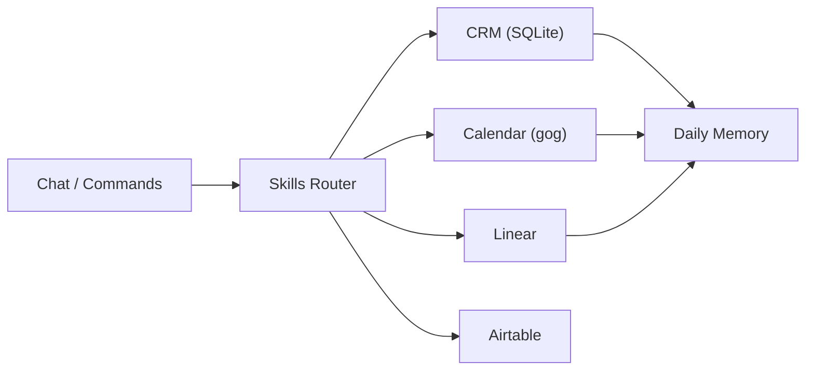

<p align="center">
  
</p>

<p align="center">
  <a href="https://github.com/xvadur/chat"></a>
  
  
</p>

<p align="center">
  
</p>

# Jarvis Runtime

Operational runtime for Jarvis on top of OpenClaw.  
This repo tracks structure, skills, and operating docs while keeping secrets and transient state local-only.

## Quickstart

```bash
cd /Users/_xvadur/.openclaw
pnpm openclaw tui
```

If CRM DB is missing:

```bash
/Users/_xvadur/.openclaw/workspace/systems/local-scripts/init_crm_db.sh
```

## Runtime Map

- `workspace/` - core identity, memory, systems, outputs
- `skills/` - local skills (`crm`, `airtable`, `slash-commands`, ...)
- `credentials/` - local credentials (not tracked)
- `openclaw.json` - local runtime config (not tracked)

Core workspace docs:
- `workspace/AGENTS.md`
- `workspace/SOUL.md`
- `workspace/USER.md`
- `workspace/IDENTITY.md`
- `workspace/MEMORY.md`
- `workspace/TOOLS.md`
- `workspace/HEARTBEAT.md`

## Ops Architecture



## Command Routing

- `/crm ...` -> local CRM skill + SQLite workflow
- `/linear ...` -> Linear skill
- `/gog ...` -> Google services skill
- `/airtable ...` -> Airtable skill

Command source-of-truth:
- `skills/slash-commands/SKILL.md`

## Security and Git Hygiene

Never commit:
- secrets/tokens (`openclaw.json`, credentials, identity files)
- runtime state (`logs`, `media`, browser/session artifacts)
- local DB artifacts (`*.sqlite`, `*.wal`, `*.shm`)

This repository is intended to stay private and team-safe for runtime collaboration.

## Team Workflow

1. Pull latest `main`.
2. Keep runtime docs/skills/scripts updated.
3. Keep secrets local.
4. Push only safe operational assets.

<p align="center">
  
</p>
